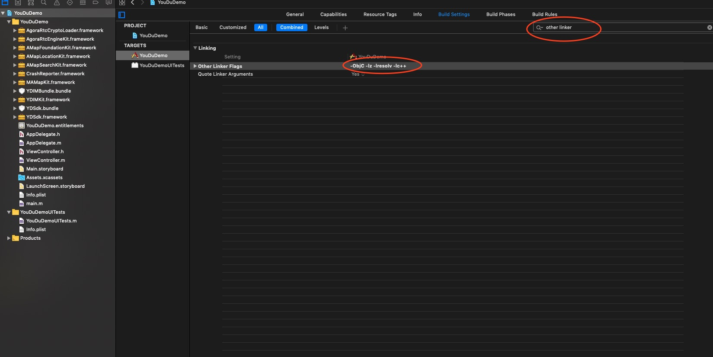
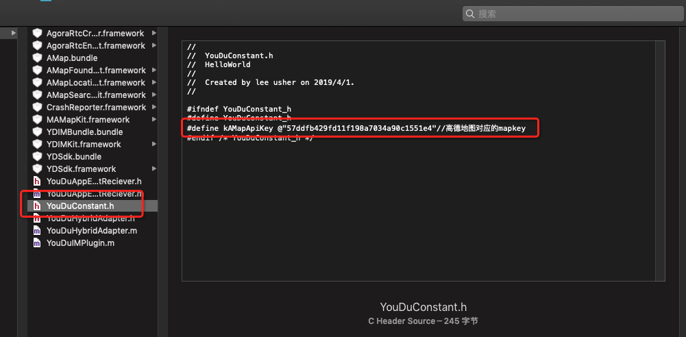
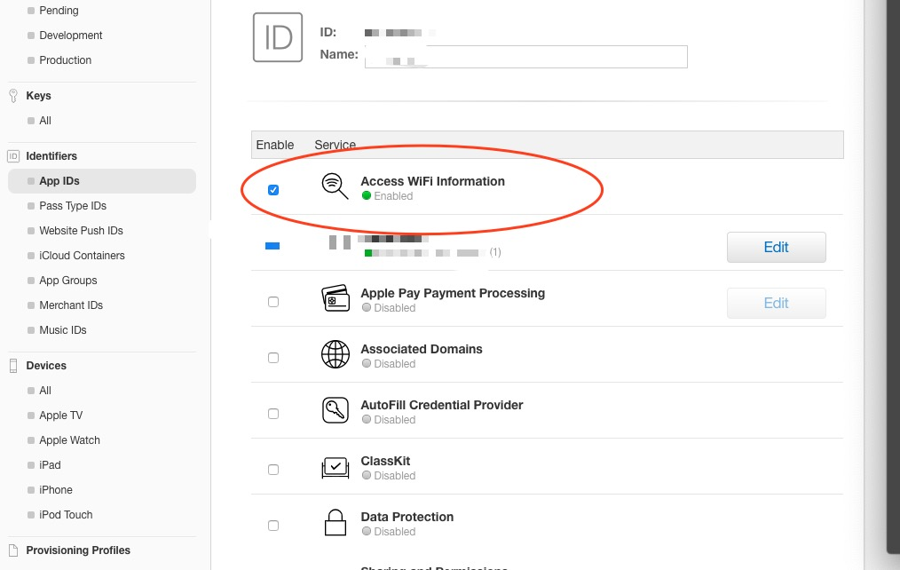
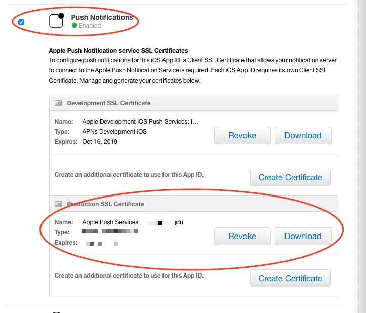
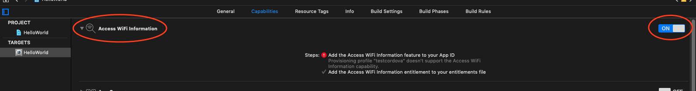
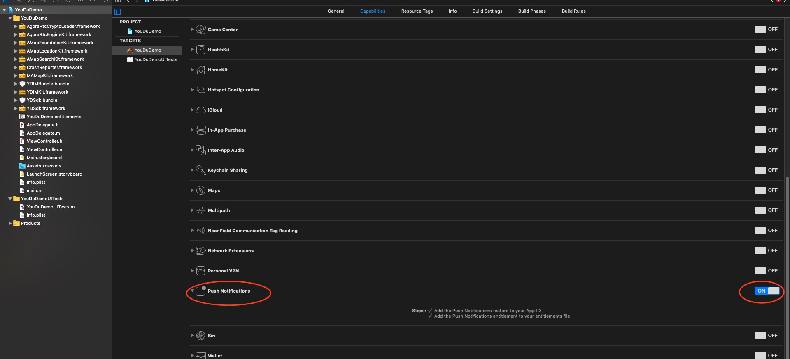

# cordova-plugin-youdu-im
  通过集成有度IM cordova 插件，能在您的app内快速集成及时通讯功能。 更多商务需求请移步[有度官网](https://youdu.im/)咨询.
# 功能
 * 会话列表
 * 聊天
 * 登陆，注销
 * 设置服务器环境，企业号
 * 创建会话
 
# 安装要求
 * Cordova Version >= 6.0.0
 * Cordova-Android >= 6.0.0
 * Cordova-iOS >= 4.0.0
 
# 安装

安装有度Cordova插件到您的工程, 您只需打开您的本地的terminal输入下面的命令:

```
cordova plugin add 插件本地磁盘存储路径. 
```

例如cordova plugin add /Users/xxx/cordova-plugin-youdu-im
    
安装成功后通过

```
cordova plugin ls 查看插件安装列表
```
显示以下插件列表表示安装完成

```
com.youdu.im 1.0.0 "YouDuIMPlugin"
cordova-labs-notification-rebroadcast 0.1.1 "Cordova Notification Rebroadcast Plugin"
cordova-plugin-whitelist 1.3.3 "Whitelist"
```

# 卸载插件

```
cordova plugin remove com.youdu.im
cordova plugin remove cordova-labs-notification-rebroadcast
```

# 插件接口说明

### 服务器设置
```
cordova.plugins.YouduIMPlugin.setServerSetting(host1, host2, port, success, error);
```
host1 外网服务器, host2 内网服务器, port 端口

success 成功回调函数, error 错误回调函数

### 登陆
```
cordova.plugins.YouduIMPlugin.loginWithAccount(account, password, success, error);
```

account账号, password 密码,success 成功回调函数,error错误回调函数

```
success回调数据	
{
	"loginSucc": "success"
}
error回调数据
{
	"loginFailed":
	{
		"title":"登录失败",
		"message":"密码错误"
	} 
}
```
### 注册消息推送(在调用登陆接口后调用该接口注册远程消息推送，第一个参数传true打开消息推送，false关闭消息推送)
```
cordova.plugins.YouduIMPlugin.RegisterForRemotePush(enablePush, success, error);
```
enablePush打开消息推送开关 success 成功回调函数,error错误回调函数

### 获取会话列表
```
cordova.plugins.YouduIMPlugin.getSessionList(success, error);
```

success 回调函数获取会话列表信息 ,error错误回调函数

```
success回调数据:
{
	"sessionList": 
	[
		{
		"at":false,    //是否有@消息
		"avoid":false,    //会话是否为消息免扰
		"content":"adf",    //最后一条消息内容 
		"failSend":false,    //是否有发送失败消息
		"msgId":1554689749,    //最后一条消息id
		"operationTime":1554713729314,    //最后操作时间,与sticky标记一起,用于排序
		"read":false,    //是否已读
		"reference":false,    //是否有回复消息
		"sessionId":"331532-331593",    //会话id
		"sticky":false,    //是否会话置顶
		"text":"adf",    //用于会话列表显示最后一条消息内容简要
		"time":1554713729314,    //最后一条消息时间
		"title":"张三",    //标题
		"type":0,    //0-单人会话, 1-多人会话, 2-广播, 3-系统, 4-SMS(未用), 5-ios小助手(占用), 6-APP 100-有度小助手, 101-应用会话, 10-互联单人会话, 11-互联多人会话
		"unreadSize":2,    //会话未读数
		"unreadText":"2",    //会话未读数
		"userId":331532    //最后一条消息发送者id
		}
	]
}
 error回调数据: 暂无
```
### 打开会话
```
cordova.plugins.YouduIMPlugin.gotoSession(sessionId, success, error);
```
sessionId 目标会话ID,success 成功回调函数,error错误回调函数
### 创建会话
```
cordova.plugins.YouduIMPlugin.gotoCreateSession(success, error);
```
success 成功回调函数,error错误回调函数
###退出登陆
```
cordova.plugins.YouduIMPlugin.logout(success, error);
```
success回调数据:
{
	"logout":"success"
} 

error回调数据: 暂无
###获取未读消息数
```
cordova.plugins.YouduIMPlugin.getUnreadCount(success, error);
```
success 成功回调函数 {"unreadCount" : 0}

error错误回调函数

###根据gids数组发起会话

```
cordova.plugins.YouduIMPlugin.chatWith(gids); 
```
gids： 用户gid数组，如[100334,100221]


# iOS注意事项
### 1.`Build Settings`->`Other Linker Flags` 中添加 `-ObjC -lz -lresolv -lc++`
   
   
   
### 2. 注册高德地图
  
 前往高德开发平台注册app，申请Key。具体的注册流程请参照高德官方文档[高德](https://lbs.amap.com/api/ios-sdk/guide/create-project/get-key)。将注册回来的mapkey填写到插件中
 
 
 

### 3.前往苹果开发者中心，打开消息推送和Wi-Fi定位功能[苹果开发者中心](https://developer.apple.com/)

  
    
  
    
   * `请将配置好的消息推送证书配置到有度服务器，保证app退到后台时仍能收到有度的消息推送`
   
### 4.工程配置

在工程中打开`access WiFi information`,`Push Notifications`。


# 注意事项
* 在AppDelegate类中重写

```
- (BOOL)application:(UIApplication*)application didFinishLaunchingWithOptions:(NSDictionary*)launchOptions
{
    [super application:application didFinishLaunchingWithOptions:launchOptions];
    self.viewController = [[MainViewController alloc] init];
    UINavigationController *nav = [[UINavigationController alloc]initWithRootViewController:self.viewController];
    self.window.rootViewController = nav;
    return YES;
}
```

* 在MainViewController类中重写

```
- (void)viewDidAppear:(BOOL)animated
{
    [super viewDidAppear:animated];
    [self.navigationController setNavigationBarHidden:YES];
}

- (void)viewWillDisappear:(BOOL)animated{
    [super viewWillDisappear:animated];
    [self.navigationController setNavigationBarHidden:NO];
}
```

# 更新说明

###v1.0.0
 * 新增获取会话列表接口
 * 新增打开聊天窗口接口
 * 新增服务器设置接口
 * 新增登陆，注销接口
 * 新增创建会话接口
 
 
